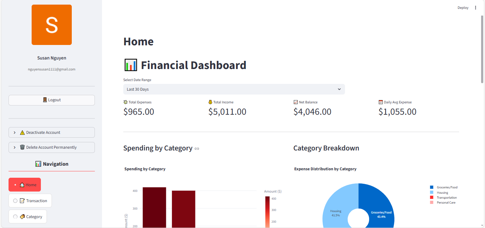
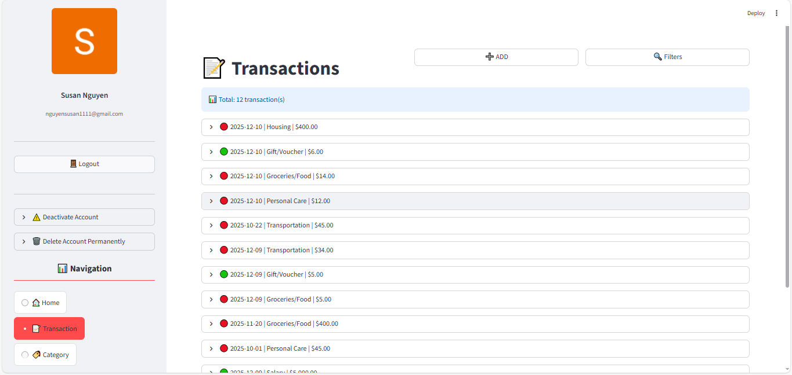
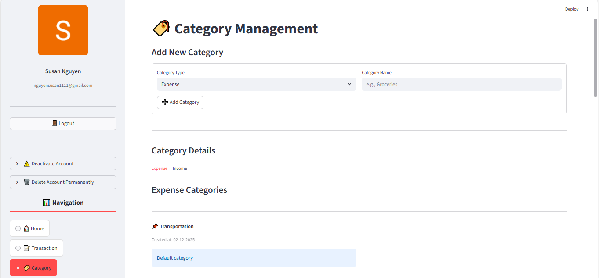

## 📊 Finance Tracker

A modular, database-driven personal finance application built with Python, MongoDB, and Streamlit.
This project lets users track transactions, manage categories, view analytics, and maintain clean financial data — all through an intuitive interface.


## 📑 Table of Contents

- [Acknowledgements](#acknowledgements)
- [Features](#features)
- [Tech Stack](#tech-stack)
- [Project Structure](#project-structure)
- [Screenshots](#screenshots)
- [Installation](#installation)
- [Run Locally](#run-locally)
- [Deployment](#deployment)
- [Troubleshooting](#troubleshooting)
- [Getting Help](#getting-help)
- [Conclusion](#conclusion)


## ✨ Acknowledgements

•	Ms. Do Thi Dieu Le – for guidance, feedback, and support

•	AI Assistance (ChatGPT, Claude, Gemini) – for documentation and problem-solving support

•	Streamlit Community – for an accessible framework for interactive apps

•	MongoDB Documentation – for schema, indexing, and best practices

•	Python & Open-Source Contributors – PyMongo, datetime, bson, and more

•	Awesome README Templates – for inspiration

•	Open-source financial apps that influenced UI and category management logic

## ✔️ Features

•	Track income and expense transactions

•	Create, rename, and delete categories

•	Reassign transactions automatically when deleting a category

•	Full MongoDB integration with indexed queries

•	Advanced filtering (date, amount, text search, type, category)

•	Streamlit-based interactive user interface

•	User-specific data separation


## 🛠️ Tech Stack

• Python (CPython): Core programming language for application logic.

• Streamlit: Framework for building the user interface.

• MongoDB Atlas: Cloud-hosted NoSQL database for persistent storage.

• PyMongo: Database driver enabling communication with MongoDB.

• Git: Version control system for managing source code.

• python-dotenv: Utility for handling environment configuration securely.


## 🧩 Project Structure

finance_tracker/
│
├── app.py
├── config.py
├── utils.py
│
├── analytics/
│   ├── analyzer.py
│   └── visualizer.py
│
├── database/
│   ├── database_manager.py
│   ├── category_models.py
│   ├── transaction_models.py
│   └── user_models.py
│
├── views/
│   ├── home_views.py
│   ├── user_views.py
│   ├── transaction_views.py
│   ├── category_views.py
│   └── category_page.py
│
├── hands-on/
├── .streamlit/
│   └── secrets.toml
├── screenshots/
│   ├── home.png
│   ├── transactions.png
│   ├── categories.png
├── requirements.txt
├── .env
└── .gitignore

## 🖼️ Screenshots

Home Page


Transactions


Categories


## ⚙️ Installation

Follow the steps below to set up and run the Finance Tracker application locally or before deploying it.

1.	Clone the repository:
git clone https://github.com/yourname/finance_tracker.git
cd finance_tracker

2.	Install required dependencies:
pip install -r requirements.txt

3.	Configure environment variables:
Create a `.env` file in the project root:
MONGO_URI=your_mongodb_connection_string

4.	(Optional) Set up Streamlit secrets:
Create `.streamlit/secrets.toml`:
[auth]
client_id=""
client_secret=""
redirect_uri=""
cookie_secret=""

5.	Run the application:
streamlit run app.py
The UI will open at: http://localhost:8501

## 💻 Run Locally
After completing the Installation steps, you can run the application on your local machine for development or testing.
```bash
streamlit run app.py
```
The UI will be available at:
```
http://localhost:8501
```
This mode is recommended for:
- Development
- Debugging
- Testing new features
- Verifying database and UI behavior

Running locally uses your **`.env`** configuration and your local Python environment.

## 🚀 Deployment

Follow the steps below to deploy the **Finance Tracker** application on **Streamlit Cloud**.

•	Push your project to GitHub
```bash
git add .
git commit -m "Deploy Finance Tracker"
git push origin main
```

•	Open Streamlit Cloud

Go to: https://share.streamlit.io
Click “New app” and connect your GitHub repository.

•	Select your repository
- Choose the GitHub account  
- Select the repository  
- Choose the branch (e.g., `main`)  
- Set the main file path: app.py

•	Configure secrets (required)**

Streamlit Cloud does not read ".env", so you must configure secrets manually.
Go to "App Settings → Secrets", then paste:
```toml
MONGO_URI="your_mongodb_connection_string"
[auth]
client_id=""
client_secret=""
redirect_uri=""
cookie_secret=""
```

•	Deploy the application

Click "Deploy".  
Streamlit Cloud will automatically:

- Install dependencies from `requirements.txt`  
- Load your secrets  
- Launch the app  

•	Your app is live 🎉

A public URL will be generated, e.g.: https://your-app-name.streamlit.app/


•	Auto-deployment

Your app automatically updates when:
- New commits are pushed  
- "requirements.txt" changes  
- Secrets are updated  

## Troubleshooting

❌App Won't Run Locally
- Install  requirements: pip install -r requirements.txt
- Check .env: Make sure it has MONGO_URI
- Check secrets: .streamlit/secrets.toml with Google Auth
- Run correct file: streamlit run app.py

🗄️ MongoDB Connection Failed
- Check URI: MONGO_URI in .env
- Add SSL suffix if needed: &ssl=true&ssl_cert_reqs=CERT_NONE
- Cluster running? Start MongoDB Atlas cluster
- IP whitelisted? Add 0.0.0.0/0 in Atlas settings

🔑 Google Login Not Working
- Secrets file exists? .streamlit/secrets.toml
- Section names correct? [auth] and [auth.google]
- Email added? Add your email under [auth.google]
- Redirect URI correct? Matches Google Cloud settings

☁️ Deployment Failed
- Code pushed to GitHub
- GitHub connected to Streamlit
- requirements.txt exists
- Secrets added in Advanced Settings
- App URL added in Google Cloud


## 💡 Getting Help
If issues persist after following this guide:
Check the official documentation of Streamlit and MongoDB
Open an issue on GitHub – the community is happy to help!

## 🎯 Conclusion

**Finance Tracker** helps you easily track income, expenses, and categories with an interactive UI and secure database. For questions or feedback, check the docs or open a GitHub issue — contributions are welcome!  

**Try it out and let us know what you think, or contribute to make it even better!**